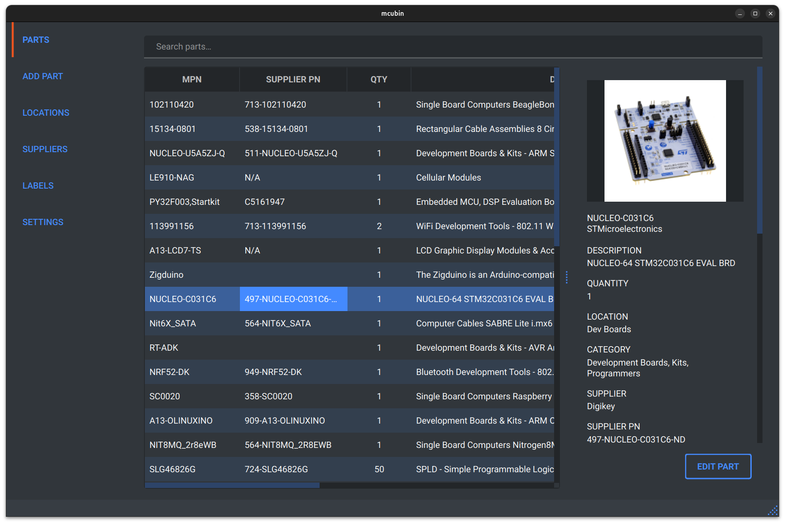
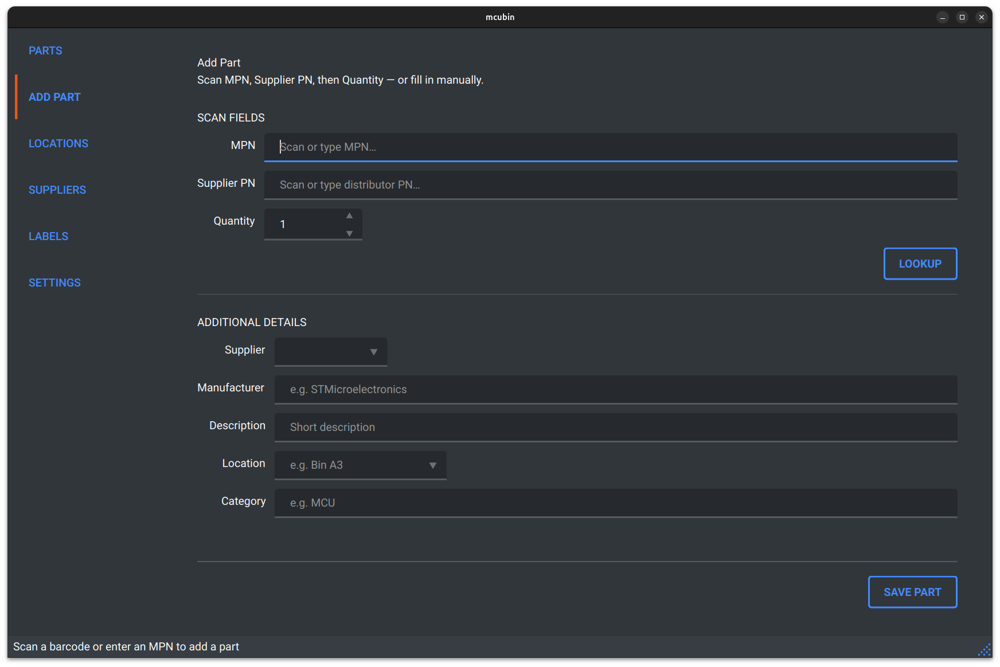
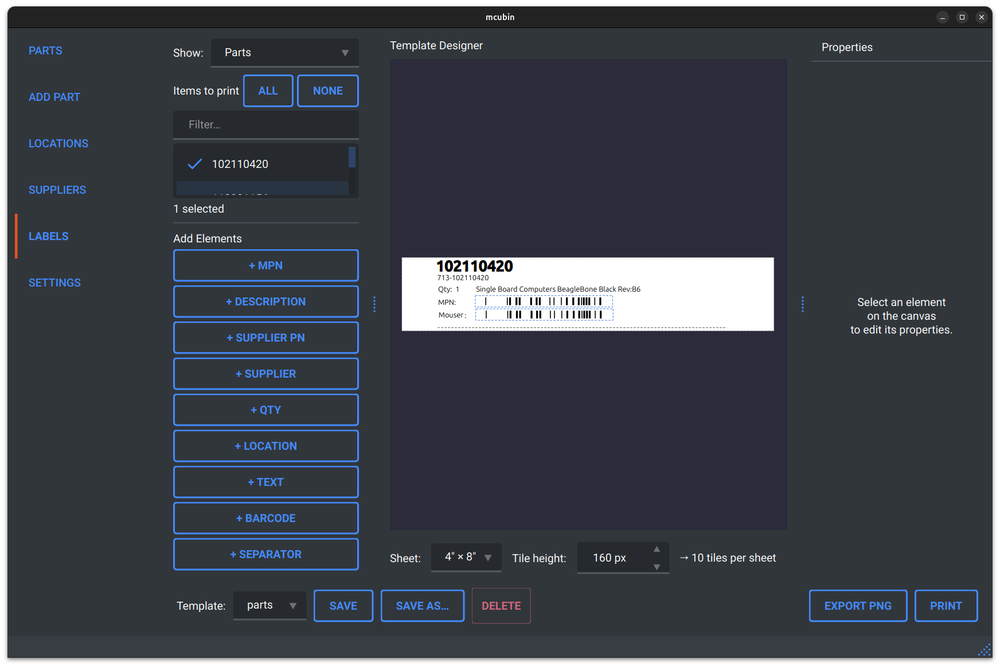

# mcubin

A desktop inventory system for electronic parts, built around one goal: **rapidly cataloguing a large collection of parts using a barcode scanner**. Scan the MPN and supplier PN off the bag, hit enter, and the part is looked up via Mouser/DigiKey API and saved — no typing required.

> **Note:** This project was built with [Claude Code](https://claude.ai/code) to fit my personal needs. It is experimental, hasn't been well tested or reviewed, and is shared as-is. Use at your own risk. Tested on Linux only.







## Features

- **Barcode scanner workflow** — scan MPN → Supplier PN → Quantity, Enter advances between fields, screen stays open for the next part
- **Mouser and DigiKey lookup** — fetches description, price breaks, datasheet, image automatically
- SQLite-backed storage with automatic Alembic migrations
- WYSIWYG label designer with ZPL output for Zebra label printers
- Sortable, resizable parts table with search
- Part detail panel with image support
- Multiple qt-material themes

## Requirements

- Python 3.11+
- Linux (only tested platform)

## Setup

```bash
python3 -m venv .venv
source .venv/bin/activate
pip install -e .
```

Or install dependencies manually:

```bash
pip install PySide6 SQLAlchemy alembic qt-material requests Pillow python-barcode zplgrf
```

## Run

```bash
PYTHONPATH=. .venv/bin/python main.py
```

The database is stored at `~/.mcubin/inventory.db` and migrations run automatically on launch.

## Supplier API Setup

### Mouser
1. Go to [mouser.ca/api-search](https://www.mouser.ca/api-search/) and click **Sign Up for Search API**
2. In mcubin: Suppliers → Add supplier → select Mouser → enter your API key

### DigiKey
1. Go to [developer.digikey.com](https://developer.digikey.com) and create a **production** app (not sandbox)
2. Subscribe to both **Product Information V4** and **Barcode** APIs
3. In mcubin: Suppliers → Add supplier → select DigiKey → enter Client ID and Client Secret

## Label Printing

The label designer (Labels tab) renders to ZPL and sends output to a USB-connected Zebra printer (tested with ZP 450). The printer device path defaults to `/dev/usb/lp0` and can be changed under Settings → Label Printing.

### Linux: printer permissions

Add your user to the `lp` group to allow writing to `/dev/usb/lp0` without sudo:

```bash
sudo usermod -aG lp $USER
```

Log out and back in for the change to take effect.

## Data Location

| File | Path |
|------|------|
| Database | `~/.mcubin/inventory.db` |
| Config | `~/.mcubin/config.json` |
| Label templates | `~/.mcubin/templates/` |
| Part images | `~/.mcubin/images/` |

## License

GPL v3. See [LICENSE](LICENSE).

## Schema Changes (for contributors)

```bash
# After editing mcubin/models.py:
PYTHONPATH=. .venv/bin/alembic revision --autogenerate -m "describe change"
PYTHONPATH=. .venv/bin/alembic upgrade head
```
